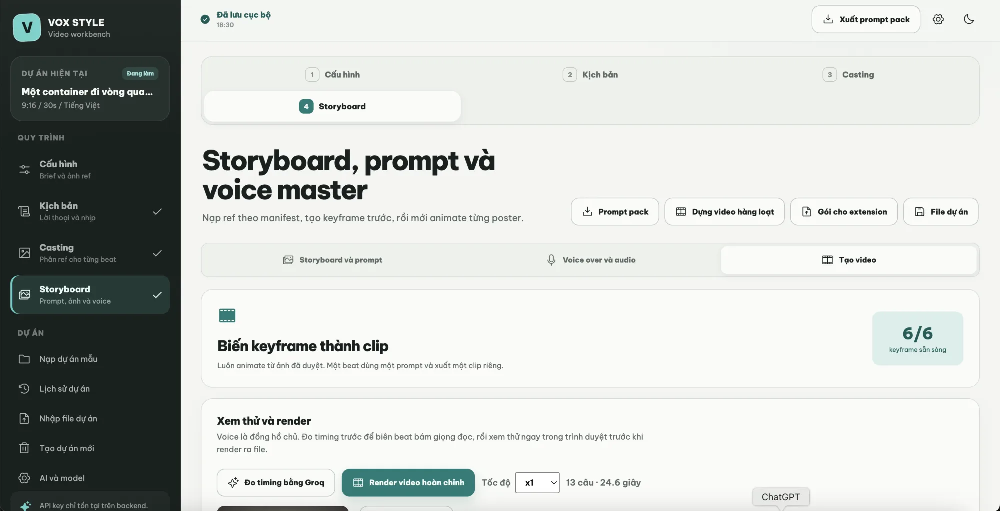

# VOX STYLE VIDEO

Ứng dụng web hỗ trợ xây dựng video giải thích theo phong cách **editorial
paper-collage**: từ brief, kịch bản, beat map và ảnh tham chiếu đến keyframe,
video, voice-over, phụ đề và bản MP4 hoàn chỉnh.



## Điểm nổi bật

- Tạo dự án chỉ từ tiêu đề video; mỗi dự án có URL riêng dạng
  `/create?id=<project-id>`.
- Tạo brief và kịch bản theo beat bằng DeepSeek V4 Flash; có giới hạn thời gian
  để không phải chờ vô hạn.
- Gemini đọc ảnh tham chiếu, mô tả nội dung và tạo từ khóa tìm kiếm chính xác.
- Dán ảnh trực tiếp từ clipboard hoặc chọn file ở mọi khu vực nhận ảnh.
- Tìm ảnh từ Pexels và Serper độc lập; từ khóa luôn được chuyển sang tiếng Anh.
- Gán reference theo từng beat và khóa nhất quán chủ thể, sản phẩm, bảng màu.
- Sinh keyframe trực tiếp bằng Coachio hoặc Gemini, có dừng, tiếp tục và thử lại
  riêng ảnh lỗi.
- Gửi storyboard sang extension ChatGPT/Gemini theo từng lượt tối đa 12 ảnh. Sau
  mỗi lượt, hệ thống dừng và hỏi người dùng trước khi chạy tiếp.
- Tạo video từ keyframe bằng Replicate hoặc nạp video có sẵn cho từng beat.
- Nạp video hàng loạt; file được sắp theo tên tự nhiên rồi gán lần lượt B01,
  B02…
- Tạo voice master bằng ElevenLabs, đo timing theo từng từ bằng Groq và xem thử
  ngay trong trình duyệt.
- Render MP4, burn overlay/phụ đề và tải file phụ đề `.ass`.
- Tự lưu dự án trên trình duyệt; hỗ trợ xuất/nhập `.vox.json` để sao lưu.
- Cập nhật API key ngay trong Settings; key chỉ được lưu ở backend local.

## Quy trình sử dụng

1. **Tạo dự án:** nhập tiêu đề video hoặc mở bảng chọn chủ đề.
2. **Cấu hình:** chọn tỷ lệ, thời lượng, ngôn ngữ, đối tượng và nạp ảnh
   reference.
3. **Kịch bản:** tạo các beat, đọc lại lời dẫn và kiểm chứng mọi claim.
4. **Casting:** chọn ảnh phù hợp cho từng beat từ file nạp, Pexels hoặc Serper.
5. **Storyboard:** duyệt prompt, tạo/nạp keyframe và điều chỉnh overlay.
6. **Video:** tạo clip từ keyframe hoặc nạp video riêng/hàng loạt.
7. **Voice-over:** tạo giọng đọc, đo timing và kiểm tra phụ đề.
8. **Xem thử và render:** duyệt toàn bộ video rồi xuất MP4 và `.ass`.

Sau khi chạy ứng dụng, có thể mở hướng dẫn trực quan tại:

```text
http://localhost:4173/guides/codex-hyperframes/
```

## Yêu cầu hệ thống

- Node.js 20 trở lên.
- npm 10 trở lên.
- Trình duyệt Chromium mới (Chrome, Edge hoặc trình duyệt tích hợp Codex).
- ffmpeg. Dự án đã kèm `ffmpeg-static`; bản ffmpeg hệ thống có `libass` sẽ giúp
  burn phụ đề trực tiếp tốt hơn.
- API key tương ứng với tính năng muốn sử dụng.

## Cài đặt nhanh

```bash
git clone https://github.com/sonlovinbot/vox-video-ai.git
cd vox-video-ai
npm ci
cp .env.example .env.local
npm run dev
```

Mở địa chỉ Vite in trên terminal, mặc định là
[http://localhost:4173](http://localhost:4173). Backend API chạy tại
`http://127.0.0.1:4174`.

Nếu dùng Windows PowerShell, thay lệnh sao chép file môi trường bằng:

```powershell
Copy-Item .env.example .env.local
```

## Cấu hình API key

Mở `.env.local` và chỉ điền key của các dịch vụ bạn dùng:

| Biến | Dịch vụ | Mục đích |
| --- | --- | --- |
| `DEEPSEEK_API_KEY` | DeepSeek | Gợi ý brief, tạo kịch bản, dịch từ khóa tìm ảnh |
| `GEMINI_API_KEY` | Google Gemini | Đọc reference và tạo keyframe |
| `COACHIO_API_KEY` | Coachio | Tạo keyframe bằng GPT Image |
| `ELEVENLABS_API_KEY` | ElevenLabs | Tạo voice master |
| `ELEVENLABS_VOICE_ID` | ElevenLabs | Voice mặc định |
| `PEXELS_API_KEY` | Pexels | Tìm ảnh stock |
| `SERPER_API_KEY` | Serper | Tìm ảnh web |
| `REPLICATE_API_TOKEN` | Replicate | Tạo video từ keyframe |
| `GROQ_API_KEY` | Groq | Căn timing lời đọc theo từng từ |

Các model mặc định đã nằm trong `.env.example` và trang **AI và model**. Bạn
cũng có thể nhập key mới trong Settings. Backend cập nhật `.env.local` nhưng
không bao giờ gửi giá trị key đã lưu trở lại trình duyệt.

> Không commit `.env.local`. File này đã được `.gitignore` loại trừ.

## Các lệnh thường dùng

```bash
# Chạy frontend và backend ở chế độ phát triển
npm run dev

# Chạy toàn bộ kiểm thử
npm test

# Kiểm tra TypeScript và tạo production bundle
npm run build

# Chạy bản production sau khi build
npm start
```

Ở production, backend phục vụ cả API và thư mục `dist` tại
`http://localhost:4173`.

## Extension tạo ảnh tự động

Storyboard có thể kết nối với extension **Auto ChatGPT Images** hoặc **Auto
Gemini Images** đã cài trên trình duyệt:

1. Mở VOX và extension trên cùng một trình duyệt.
2. Vào Storyboard, chọn **Generate with ChatGPT** hoặc **Generate with Gemini**.
3. Mỗi lượt xử lý tối đa 12 ảnh.
4. Khi lượt hoàn tất, kiểm tra kết quả trong popup.
5. Bấm tiếp tục để chạy 12 ảnh kế tiếp; ảnh lỗi có thể chạy lại riêng.

Extension là thành phần tùy chọn và không bắt buộc nếu bạn tạo ảnh trực tiếp
bằng Coachio hoặc Gemini API.

## Dữ liệu và bảo mật

- Cấu hình dự án được lưu trong `localStorage` của trình duyệt.
- Ảnh, audio, video và file render do backend tạo nằm trong `generated/`.
- `generated/`, `dist/`, `node_modules/`, `.env.local` và gói phát hành đều
  không được đưa lên Git.
- Xuất file `.vox.json` thường xuyên nếu dự án quan trọng hoặc cần chuyển máy.
- Ảnh reference được lưu dưới dạng data URL; nên nén ảnh trước khi nạp để tránh
  chạm giới hạn dung lượng trình duyệt.
- Việc tạo ảnh, giọng đọc hoặc video có thể phát sinh chi phí tại nhà cung cấp.

## Kiểm tra trước khi cập nhật GitHub

```bash
npm test
npm run build
git diff --check
git status
```

Tạo nhánh và đẩy thay đổi:

```bash
git switch -c feat/ten-ban-cap-nhat
git add README.md .env.example server src public
git commit -m "feat: cập nhật VOX Style Video"
git push -u origin feat/ten-ban-cap-nhat
```

Sau đó mở Pull Request trên GitHub, kiểm tra lại danh sách file và merge vào
`main` khi build/test đều đạt.

## Cập nhật bản mới trên máy khác

```bash
git pull origin main
npm ci
npm run build
```

Giữ lại `.env.local` của máy; không sao chép API key vào mã nguồn.

## Xử lý lỗi nhanh

- **Không mở được web:** kiểm tra URL Vite in trên terminal; nếu cổng 4173 đang
  bận, Vite sẽ chọn cổng khác.
- **Frontend mở được nhưng AI không chạy:** kiểm tra backend cổng 4174 và API
  key trong Settings.
- **Tạo kịch bản lâu:** dùng `deepseek-v4-flash`; hệ thống đã tắt reasoning cho
  tác vụ JSON và tự dừng yêu cầu sau 45 giây.
- **Extension không kết nối:** reload extension, sau đó reload trang VOX và bấm
  Reconnect.
- **Render thiếu phụ đề:** tải file `.ass` đi kèm hoặc cài ffmpeg có `libass`.
- **Dự án quá nặng:** xuất `.vox.json`, giảm kích thước ảnh reference và xóa
  media không dùng.

## Lưu ý nội dung

AI chỉ nên dùng dữ kiện do người dùng cung cấp. Luôn kiểm chứng số liệu, tên
riêng, nguồn và claim trước khi duyệt storyboard hoặc xuất bản video.
